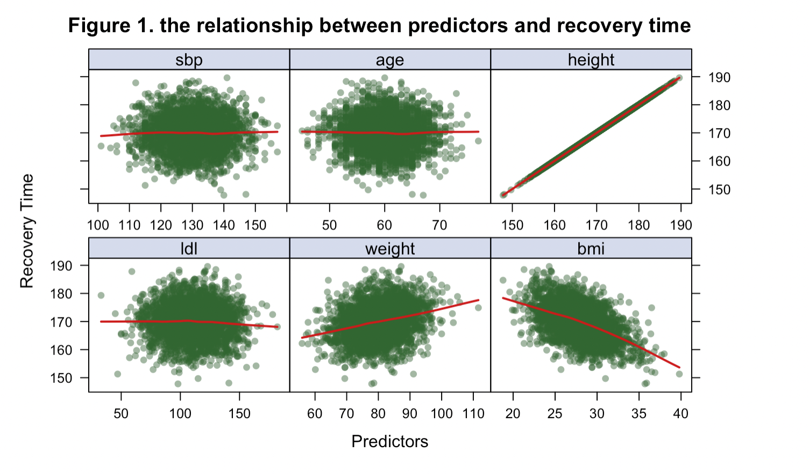
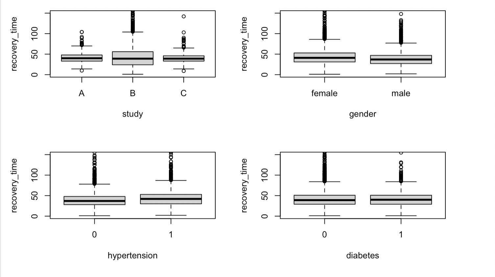

---
title: "P8106 Final Project"
date: "May 10, 2023"
author: "Wenjia Zhu, Ruihan Zhang, Jierou Niu"
output:
  pdf_document:
    toc: yes
    toc_depth: 2
  keep_tex: true
  html_document:
    df_print: paged
    toc: yes
    toc_depth: '2'
header-includes:
- \usepackage{hyperref}
- \hypersetup{colorlinks=false, linktoc=all, linkcolor=red}
# - \AtBeginDocument{\addtocontents{toc}{\protect\hypertarget{mylink}{}\hspace{0.25in}\hspace{0.5in}\par}}
- \usepackage{placeins}
- \usepackage{caption}
- \usepackage{fancyhdr}
- \usepackage{lipsum}
- \pagestyle{fancy}
- \fancyhead[R]{\thepage}
- \usepackage{amsmath}
- \usepackage{algpseudocode}
- \usepackage{algorithm}

--- 

```{r setup, include=FALSE}
knitr::opts_chunk$set(echo = TRUE, 
                      message = FALSE, 
                      warning = FALSE, 
                      results = 'asis', 
                      fig.align = "center")
```

\newpage

```{r, include=FALSE}

library(plyr)
library(caret)
library(FNN) 
library(dplyr)
library(kernlab)
library(factoextra)
library(e1071)
library(ggplot2)
library(caret)
library(pROC)
library(partykit)
library(randomForest)
library(mlbench)
library(ranger)
library(ISLR)
library(MASS)
library(knitr)
library(earth)
library(mgcv)
library(party)
library(doBy) 
library(tidyverse)
```

# Background
To better understand the factors that predict recovery time from COVID-19 illness, a study was designed to combine three existing cohort studies that have been tracking participants for several years. The study collects recovery information through questionnaires and medical records and leverages existing data on personal characteristics before the pandemic. The ultimate goal is to develop a prediction model for recovery time and identify important risk factors for a long recovery time.

# Introduction
The aim of this research is to develop a prediction model for recovery time from COVID-19 by merging three cohort studies that have been following participants for several years. Recovery information will be gathered through questionnaires and medical records, and personal characteristics data from before the pandemic will be utilized. The primary objective is to identify important risk factors for longer recovery time and gain a better understanding of the predictors of recovery time from COVID-19.

# Data and Exploratory Analysis
This study employs the recovery.RData file, which comprises a dataset of 10,000 participants. The dataset contains a variable for recovery time from COVID-19 (in days) along with 14 predictor variables, including demographic features, personal characteristics, vital measurements, and disease status. The predictors consist of both continuous and categorical variables. The study used two merged random samples of 2000 participants each, obtained from UNI wz2631 and another UNI jn2855 midterm project dataset, to create the dataset. The training dataset contains 80% of the sample and, the test dataset contains the remaining 20%. 


```{r,echo=FALSE,out.width='90%',out.height='70%',fig.align='center'}

```
\begin{center}
Figure 1. the relationship between continous predictors(sbp, ldl, age, weight, height and bmi) and recovery time
\end{center}
Five lattice plots have been used to visualize the relationship between continuous predictors(sbp, ldl, age, weight, height and bmi) and recovery time. There is almost no relationship between sbp and recovery time, between age and recovery time, and between ldl and recovery time. There is a positive relationship between height and recovery time, and between weight and recovery time. There is a negative relationship between bmi and recovery time.

```{r,echo=FALSE,out.width='90%',out.height='70%',fig.align='center'}

```
```{r,echo=FALSE,out.width='90%',out.height='70%',fig.align='center'}
knitr::include_graphics("graph2/eda3.png")
```
\begin{center}
Figure 2. the relationship between categorical predictors(study, hypertension, gender, diabetes, vaccine, race, and severity) and recovery time
\end{center}
Seven boxplots have been used to visualize the relationship between continuous predictors(study, hypertension, gender, diabetes, vaccine, race, and severity) and recovery time. There is no large difference in recovery time among patients in study A, study B and study C. Patients with hypertension have a slightly longer recovery time than patients without hypertension. Female patients have a slightly longer recovery time than male patients. There is almost no difference in recovery time between patients with diabetes and patients without diabetes. Vaccinated patients have a slightly shorter recovery time than unvaccinated patients. There is almost no difference in recovery time among white patients, Asian patients, black patients and hispanic patients. 

# Primary Analysis

# Secondary Analysis

