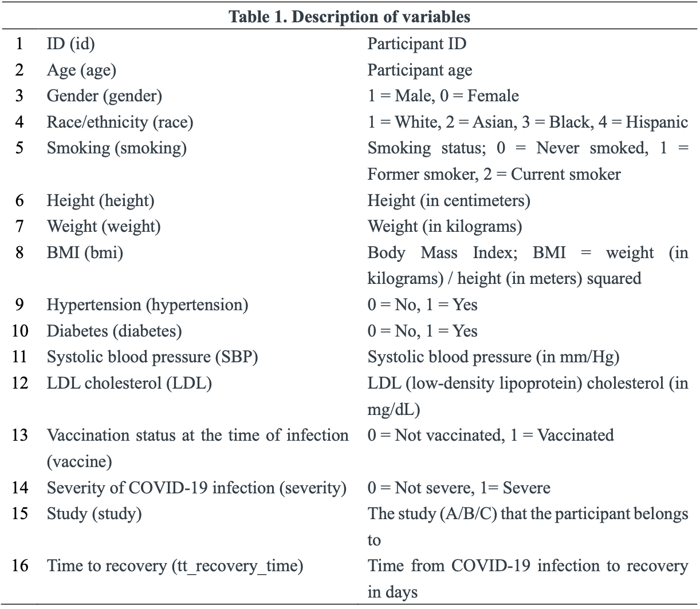

---
title: "P8106 Final Project"
date: "May 10, 2023"
author: "Wenjia Zhu, Ruihan Zhang, Jierou Niu"
output:
  pdf_document:
    toc: yes
    toc_depth: 2
  keep_tex: true
  html_document:
    df_print: paged
    toc: yes
    toc_depth: '2'
header-includes:
- \usepackage{hyperref}
- \hypersetup{colorlinks=false, linktoc=all, linkcolor=red}
# - \AtBeginDocument{\addtocontents{toc}{\protect\hypertarget{mylink}{}\hspace{0.25in}\hspace{0.5in}\par}}
- \usepackage{placeins}
- \usepackage{caption}
- \usepackage{fancyhdr}
- \usepackage{lipsum}
- \pagestyle{fancy}
- \fancyhead[R]{\thepage}
- \usepackage{amsmath}
- \usepackage{algpseudocode}
- \usepackage{algorithm}

--- 

```{r setup, include=FALSE}
knitr::opts_chunk$set(echo = TRUE, 
                      message = FALSE, 
                      warning = FALSE, 
                      results = 'asis', 
                      fig.align = "center")
```

\newpage

```{r, include=FALSE}

library(plyr)
library(caret)
library(FNN) 
library(dplyr)
library(kernlab)
library(factoextra)
library(e1071)
library(ggplot2)
library(caret)
library(pROC)
library(partykit)
library(randomForest)
library(mlbench)
library(ranger)
library(ISLR)
library(MASS)
library(knitr)
library(earth)
library(mgcv)
library(party)
library(doBy) 
library(tidyverse)
```

# Background
To better understand the factors that predict recovery time from COVID-19 illness, a study was designed to combine three existing cohort studies that have been tracking participants for several years. The study collects recovery information through questionnaires and medical records and leverages existing data on personal characteristics before the pandemic. The ultimate goal is to develop a prediction model for recovery time and identify important risk factors for a long recovery time.

# Introduction
The aim of this research is to develop a prediction model for recovery time from COVID-19 by merging three cohort studies that have been following participants for several years. Recovery information will be gathered through questionnaires and medical records, and personal characteristics data from before the pandemic will be utilized. The primary objective is to identify important risk factors for longer recovery time and gain a better understanding of the predictors of recovery time from COVID-19.

# Data and Exploratory Analysis
This study employs the recovery.RData file, which comprises a dataset of 10,000 participants. The dataset contains a variable for recovery time from COVID-19 (in days) along with 14 predictor variables, including demographic features, personal characteristics, vital measurements, and disease status. The predictors consist of both continuous and categorical variables. The study used two merged random samples of 2000 participants each, obtained from UNI wz2631 and another UNI jn2855 midterm project dataset, to create the dataset. The training dataset contains 80% of the sample and, the test dataset contains the remaining 20%. 

```{r,echo=FALSE,out.width='90%',out.height='70%',fig.align='center'}

```

```{r,echo=FALSE,out.width='90%',out.height='70%',fig.align='center'}
knitr::include_graphics("graph2/eda1.png")
```
\begin{center}
Figure 1. the relationship between continous predictors(sbp, ldl, age, weight, height and bmi) and recovery time
\end{center}
Five lattice plots have been used to visualize the relationship between continuous predictors(sbp, ldl, age, weight, height and bmi) and recovery time. There is almost no relationship between sbp and recovery time, between age and recovery time, and between ldl and recovery time. There is a positive relationship between height and recovery time, and between weight and recovery time. There is a negative relationship between bmi and recovery time.

```{r,echo=FALSE,out.width='90%',out.height='70%',fig.align='center'}
knitr::include_graphics("graph2/eda2.png")
```
```{r,echo=FALSE,out.width='90%',out.height='70%',fig.align='center'}
knitr::include_graphics("graph2/eda3.png")
```
\begin{center}
Figure 2. the relationship between categorical predictors(study, hypertension, gender, diabetes, vaccine, race, and severity) and recovery time
\end{center}
Seven boxplots have been used to visualize the relationship between continuous predictors(study, hypertension, gender, diabetes, vaccine, race, and severity) and recovery time. There is no large difference in recovery time among patients in study A, study B and study C. Patients with hypertension have a slightly longer recovery time than patients without hypertension. Female patients have a slightly longer recovery time than male patients. There is almost no difference in recovery time between patients with diabetes and patients without diabetes. Vaccinated patients have a slightly shorter recovery time than unvaccinated patients. There is almost no difference in recovery time among white patients, Asian patients, black patients and hispanic patients. 


# Model Training
Eleven models were used in this project, which are the linear model, LASSO model, ridge model, PCR model, GAM model, MARS model, elastic net model, and PLS model.

**A linear model** assumes $Y=\beta_0+\beta_1X+\epsilon$, where $\epsilon\sim N(0,\sigma^2).$ The train() function with 10-fold cross-validation was used to fit this linear model 5 times, as specified by the trainControl() function, using linear regression. Statistical information about the model was obtained by summarizing it. 

**The ridge regression** assumes that the dependence of outcome on predictors is linear and that the errors have constant variance and normal distribution. It allows the coefficients $\hat\beta^R_\lambda$ to minimize $RSS+\lambda\sum_i^p\beta_i^2$ towards zero to prevent overfitting. Ridge regression also assumes that all predictor variables have the same scale, as it involves the penalty term that adds the square of the coefficients to the objective function, and without the same scale, variables with larger values can dominate the penalty term. This model was created using the train function with 10-fold cross-validation repeated 5 times, as specified by the trainControl() function. The method used was glmnet within the train function. The tuning parameters were set using the tuneGrid argument with a range from $\exp\{-1\}$ to $\exp\{6\}$ and a length of 100. The model was specified by setting the alpha parameter to 0.

**The Lasso model** assumes that the dependence of the outcome on predictors is linear and that the errors have a constant variance and normal distribution. It also assumes that the predictors are not highly correlated with each other. One key aspect of the Lasso model is its use of the L1 penalty, which shrinks some of the coefficient estimates $\hat\beta^R_\lambda$ to minimize $RSS+\lambda\sum_i^p|\beta_i|$ towards zero and can effectively perform variable selection by setting some coefficients exactly to zero. To fit this Lasso model, the train() function was used with 10 folds cross validation, repeated 5 times. The method used was glmnet within the train function. The tuning parameters were set using the tuneGrid argument with a range from $\exp\{-1\}$ to $\exp\{5\}$ and a length of 100. The Lasso model was specified by setting the alpha parameter to 1. To obtain all possible combinations of lambda and alpha, the expand.grid() function was utilized.

**Elastic Net** is a linear regression model that combines the penalties of Lasso and Ridge regression to overcome some of their limitations. It minimizes $\sum_i^n(y_i-\beta_0-\sum_i^n\beta_jx_{ij})^2+\lambda_1\sum_i^p\beta_j^2+\lambda_2|\beta_j|$. It assumes that the dependence of the outcome on predictors is linear and that the errors have a constant variance and normal distribution. Elastic Net also assumes that there is no multicollinearity among predictors. Additionally, it assumes that the data is standardized before fitting the model, so that all predictors have the same scale. This model was trained using the train function with 10-fold cross-validation for 5 iterations, utilizing the trainControl() function. The method employed was glmnet within the train function. The tuning parameters for this model included 21 values for the alpha parameter ranging from 0 to 1, and 50 values for the lambda parameter ranging from $\exp\{-10\}$ to $\exp\{10\}$. The expand.grid() function was utilized to generate all possible combinations of lambda and alpha for tuning the model.


**PLS (Partial Least Squares)** assumes that there is a linear relationship between the predictor variables and the response variable, and that there may be multicollinearity among the predictor variables. PLS also assumes that the number of predictor variables is larger than the number of observations in the dataset. The PLS model was trained using the train function with 10-fold cross-validation for 5 iterations, controlled by trainControl. The pls method was used within the train() function. The tuneGrid argument used a data frame with one column, ncomp, which ranged from 1 to 20. The training data were centered and scaled using the preProcess argument with "center" and "scale" options, respectively.

**PCR (Principal Component Regression)** assumes that the predictors are linearly related to the outcome variable, and that there is no multicollinearity among the predictors. PCR also assumes that the first few principal components capture most of the variability in the predictors and that the remaining principal components do not contain any significant information. The pcr method was used within the train() function. The tuneGrid argument used a data frame with one column, ncomp, which ranged from 1 to 19. The training data were centered and scaled using the preProcess argument with "center" and "scale" options, respectively.

**MARS (Multivariate Adaptive Regression Splines)** is a non-parametric regression method that can capture non-linearities and interactions between variables. It assumes that the relationship between the predictors and the outcome is additive, i.e., the effect of each predictor on the outcome is independent of the values of other predictors. MARS also assumes that the relationship is continuous and that there are no significant outliers or influential observations. This model was created using the train() function with 10-fold cross-validation repeated 5 times, as specified by the trainControl() function. The method used was earth within the train function. To create a grid of tuning parameters, the expand.grid function was used with the degree ranging from 1 to 3 and the nprune ranging from 2 to 18. 

**GAM (Generalized Additive Model)** assumes that the relationship between the response variable and predictors is non-linear but retains the additive structure of linear models. It can be represented as a sum of smooth functions of the predictors. The model assumes that the errors have a constant variance and are independent and normally distributed. Additionally, GAM assumes that the effects of each predictor are additive and can be represented by smooth functions. The model is also assumed to have no multicollinearity among the predictor variables. This model was trained using the train() function with 10-fold cross-validation repeated 5 times, using the trainControl() function. The method used was gam, as specified in the train() function.

**Regression trees** assume that the relationship between the dependent variable and the independent variables is non-linear and can be represented as a tree-like structure. The model can capture complex interactions between the predictors and the outcome variable, and it can handle non-normal distributions and non-constant variance of errors.The tuneGrid argument is used to specify a grid of 50 values for cp is created using the exp function to generate values between $\exp\{-6\}$ and $\exp\{-2\}$. This model was trained using the train() function with 10-fold cross-validation repeated 5 times, using the trainControl() function. 


Additionally, the RMSE of each model was computed by comparing predicted and actual recovery time values.
# Primary Analysis

# Secondary Analysis

# Conclusion